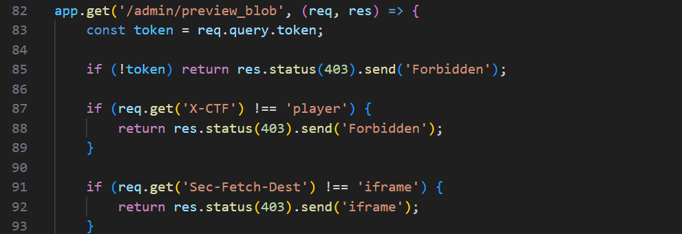
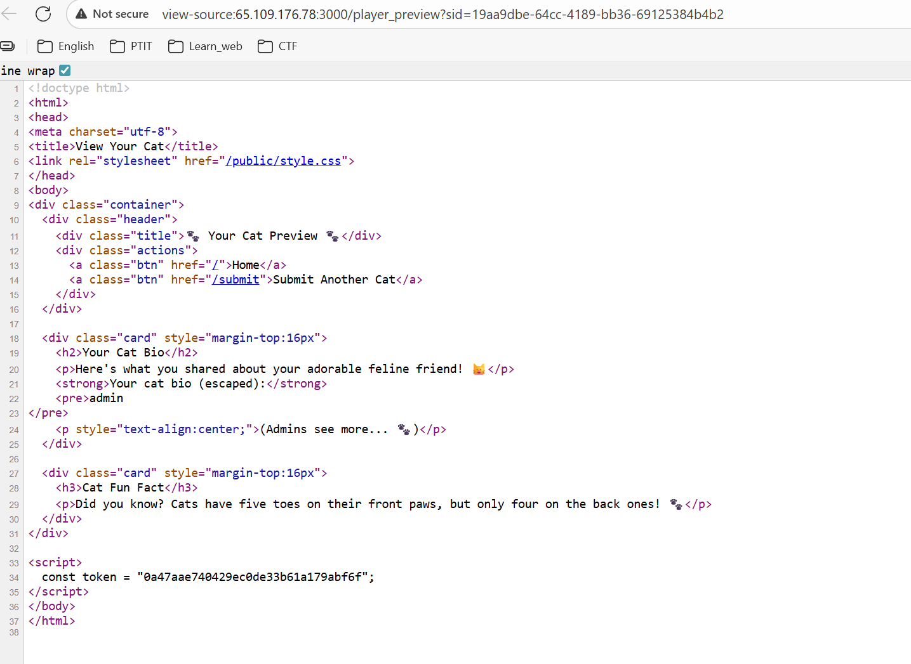
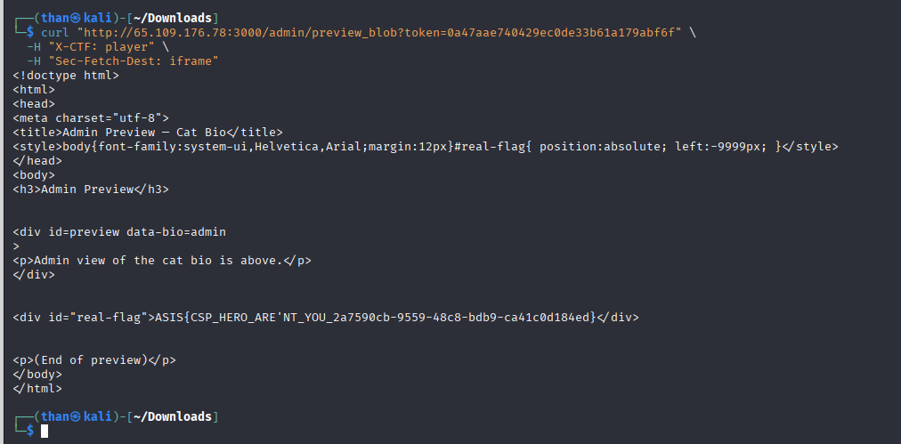

**Challenge:** Cat_Lovers_Hub  
**Category:** Web — Access Control Bypass  
**Src:** [Cat_Lovers_Hub](../Cat_Lovers_Hub/)

## Overview

A Node.js application with a hidden admin preview endpoint protected by weak header-based validation. The vulnerability allows bypassing access controls to retrieve the flag from admin templates.

## Analysis

### Key Endpoints

- `/submit` - Creates bio and generates admin preview token
- `/admin/preview_blob` - Protected endpoint containing flag

### Vulnerability

The admin endpoint checks only HTTP headers for authentication:



Headers can be easily spoofed, and tokens are exposed in client-side code.

## Exploitation

### Step 1: Token Discovery

Submit any bio content to trigger token generation:

**Action:** Navigate to `/submit` and submit any cat bio  
**Result:** Redirected to `/player_preview` page



### Step 2: Token Extraction

The player preview page exposes the admin token in client-side JavaScript:

**Method:** View page source or inspect element  
**Token Location:**

```javascript
const token = "0a47aae740429ec0de33b61a179abf6f";
```

### Step 3: Admin Access

Use the extracted token to access the protected admin endpoint:

```bash
curl "http://65.109.176.78:3000/admin/preview_blob?token=0a47aae740429ec0de33b61a179abf6f" \
  -H "X-CTF: player" \
  -H "Sec-Fetch-Dest: iframe"
```



**Response:** Admin preview HTML containing the flag

## Flag

`ASIS{CSP_HERO_ARE'NT_YOU_2a7590cb-9559-48c8-bdb9-ca41c0d184ed}`

---

_Author: Gia Than_

